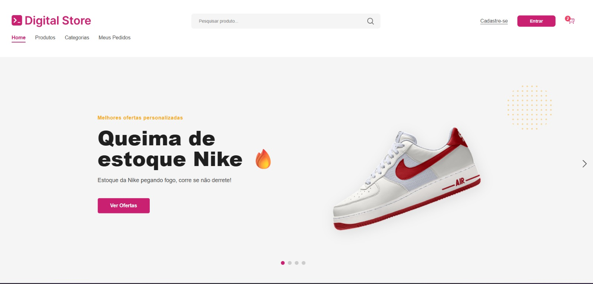
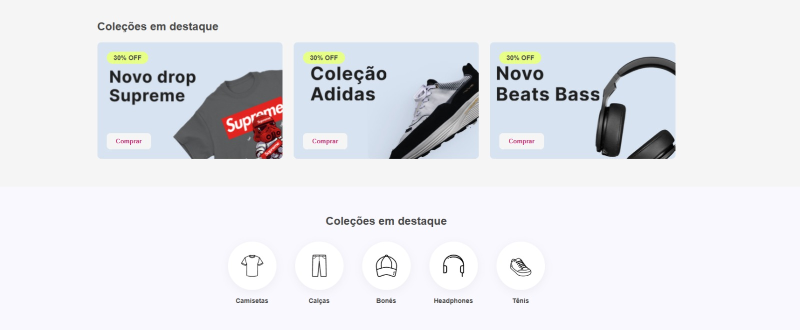
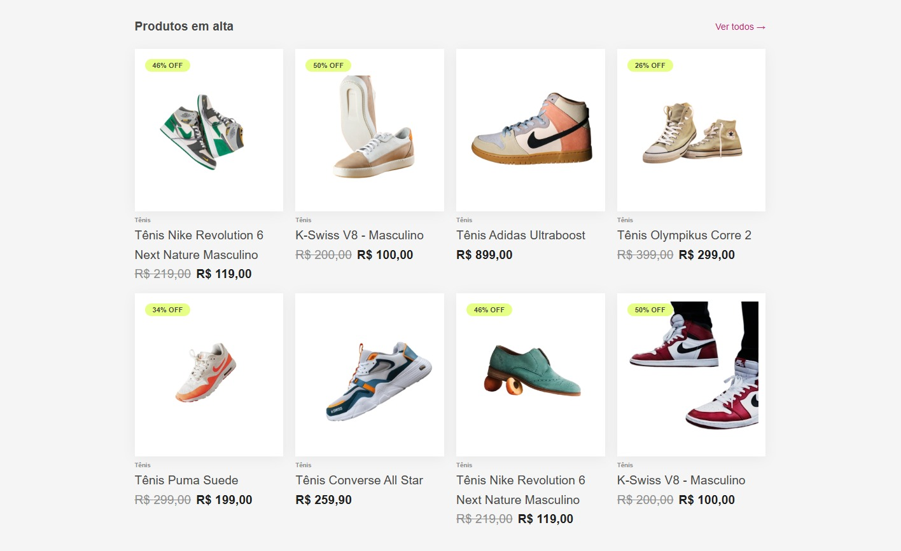
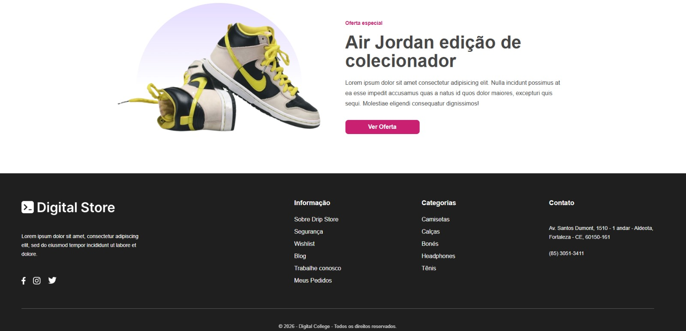

# Projeto Drip Store - Frontend 👟👕

Este projeto foi desenvolvido como parte do **Bootcamp Geração Tech 3.0** da Digital College.
Trata-se de um e-commerce de moda e calçados, focado em uma experiência de usuário moderna e responsiva.

## 📸 Demonstração






## 👥 Autor
**WeberFern**
- GitHub: [weberfern](https://github.com/weberfern)
- Email: weber12@gmail.com

## 🚀 Tecnologias Utilizadas
- **React**: Biblioteca JavaScript para construção de interfaces.
- **Vite**: Ferramenta de build rápida e otimizada.
- **React Router**: Gerenciamento de rotas e navegação.
- **CSS3**: Estilização com variáveis e flexbox/grid.

## 📦 Como Rodar o Projeto

1. Clone o repositório:
```bash
git clone https://github.com/weberfern/projeto-final-gtech-frontend.git
```

2. Instale as dependências:
```bash
cd Projeto-Final-GTech
npm install
```

3. Rode o projeto:
```bash
npm run dev
```

## 🎨 Funcionalidades
- **Home Page**:
  - Carrossel de destaques (Hero Slide).
  - Coleções em destaque.
  - Ícones de categorias.
  - Listagem de produtos em alta.
  - Seção de Oferta Especial.
- **Componentes Reutilizáveis**: Header, Footer, Gallery, ProductCard, Section, etc.
- **Responsividade**: Layout adaptável para mobile e desktop.

---
Desenvolvido por WeberFern durante o Bootcamp Geração Tech 3.0.
