# 🛒 Projeto Final Geração Tech 3.0 - Frontend 👟👕

Este projeto foi desenvolvido como parte do **Bootcamp Geração Tech 3.0** da Digital College.
Trata-se de um e-commerce, focado em uma experiência de usuário moderna e responsiva.

> [!NOTE]
> Acesse o projeto: [https://projeto-final-gtech-frontend.vercel.app/](https://projeto-final-gtech-frontend.vercel.app/)

## 👥 Autores

**Weber Fernandes**
- GitHub: [weberfern](https://github.com/weberfern)
- Email: [weber12@gmail.com]

**Sandra Vasconcelos**
- GitHub: [SandraVasconcelos-74](https://github.com/SandraVasconcelos-74)
- Email: [sandrajulala@gmail.com]

**Assis Sousa**
- GitHub: [assissousa](https://github.com/assissousa)
- Email: [assispsousa@gmail.com]

## 📂 Estrutura de Pastas
O projeto foi totalmente organizado separando as esferas de componentes modulares de suas páginas agregadoras, garantindo fácil manutenção, menor poluição de leitura e roteamento claro usando o DOM virtual da árvore do React.

```text
├── src/
│   ├── assets/       # Ponto de cache para Ícones estáticos e logomarcas
│   ├── components/   # Componentes da aplicação (Header, Footer, ProductCard, etc)
│   │   └── styles/   # Estilos (CSS) em escopo modular
│   ├── data/         # Mock simulando o recebimento de Produtos do Back-end
│   ├── layouts/      # Camadas Mestres (Carrega Headers e Footers de Base)
│   ├── pages/        # Telas completas roteáveis consumindo os componentes
│   ├── App.jsx       # Controlador Integrador de Rotas e Navegação (Router)
│   └── main.jsx      # Ponto de Injeção Primária no Elemento Raiz do DOM
```

## 🚀 Tecnologias Utilizadas
- **React**: Biblioteca JavaScript para construção de interfaces.
- **Vite**: Ferramenta de build rápida e otimizada.
- **React Router**: Gerenciamento de rotas e navegação.
- **CSS3**: Estilização com variáveis e flexbox/grid.

## 📦 Como Rodar o Projeto

1. Clone o repositório:
```bash
git clone https://github.com/weberfern/projeto-final-gtech-frontend.git
```

2. Instale as dependências:
```bash
cd drip-store
npm install
```

3. Rode o projeto:
```bash
npm run dev
```

## 🎨 Funcionalidades e Rotas Entregues
- **Home Page** (`/`): Carrossel dinâmico, galerias promocionais e vitrine de tendência.
- **Listagem de Produtos** (`/products`): Grade dinâmica de cartões responsivos, com integração baseada em Checkboxes e Menu de Ordenação de Preço, capturando interações da URL paramétrica.
- **Página de Visualização do Produto** (`/product/:id`): Galeria Swiper de Imagens completa. Seletores de tamanho/cor, cálculo automático das taxas de desconto (%) e BuyBox rica, contendo listagem fluida de produtos recomendados.
- **Categorias** (`/categories`): Rota dedicada unificando todos os atalhos departamentais.
- **Meus Pedidos** (`/orders`): Componente limpo de fallback amigável informando a situação da conta.
- **Componentes Altamente Escaláveis**: `Header` rico, `Footer` robusto, `Gallery` otimizada com pré-carregamento, `ProductCard`, `FilterGroup`, entre outros.
- **Mobile First e Flexlayout**: 100% responsivo para dispositivos móveis com menus gavetas, empilhamento elegante e adequação rigorosa as margens solicitadas pelo Figma.

## 📸 Demonstração

### ✨ Página Inicial (Home)
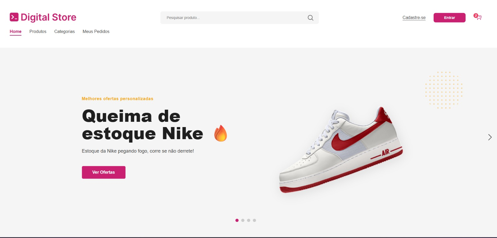
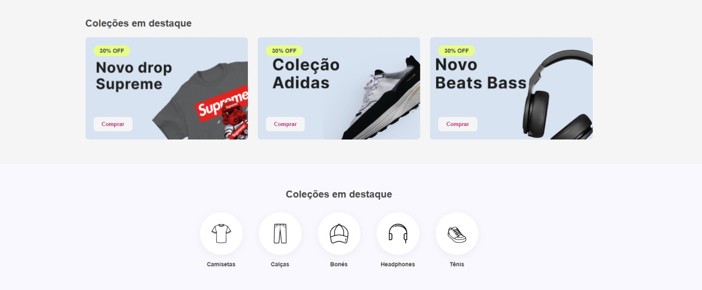
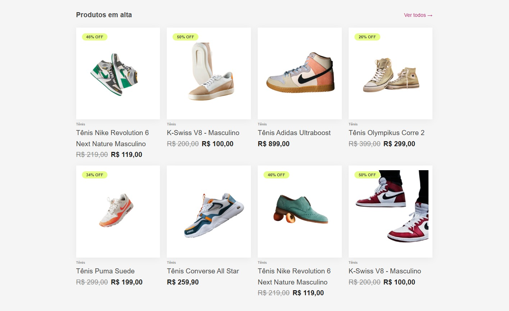
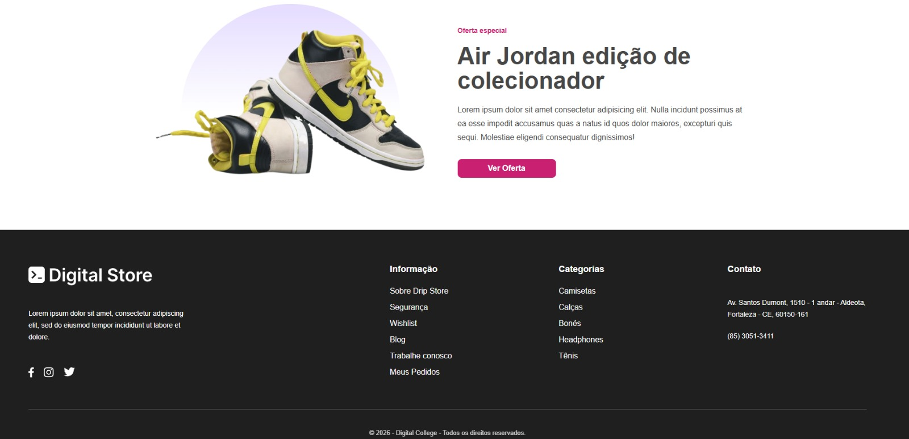

### 🛍️ Tela de Produtos (Filtros e Listagem)
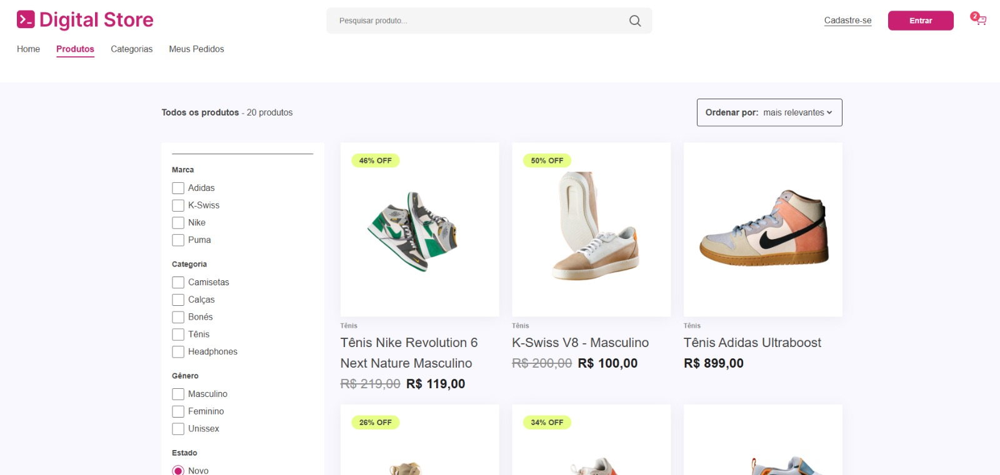

### 👟 Visualização do Produto (Detalhes da Compra)
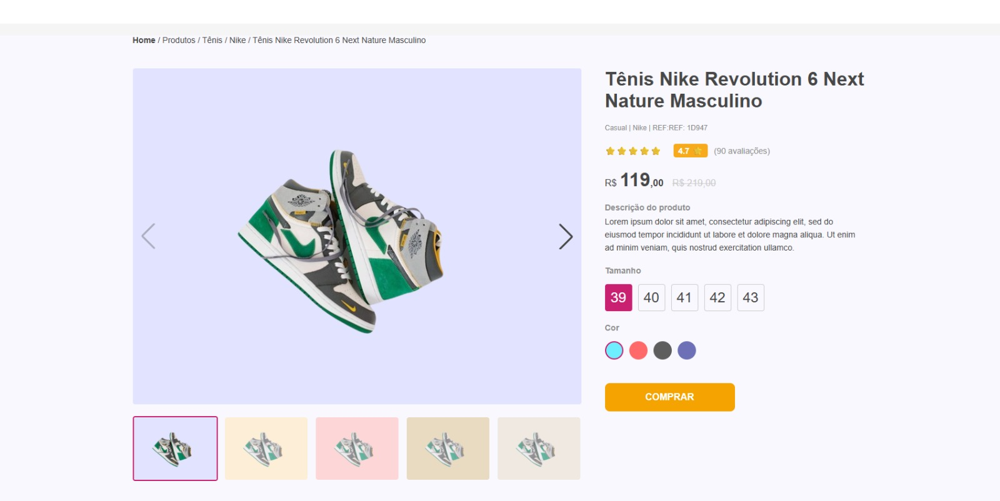
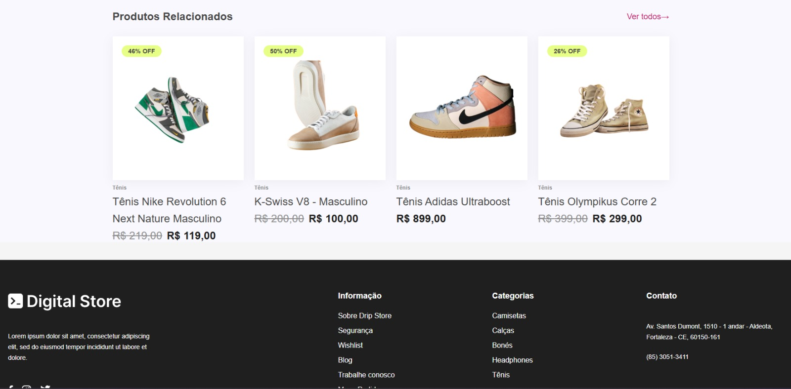

### 📑 Tela de Categorias
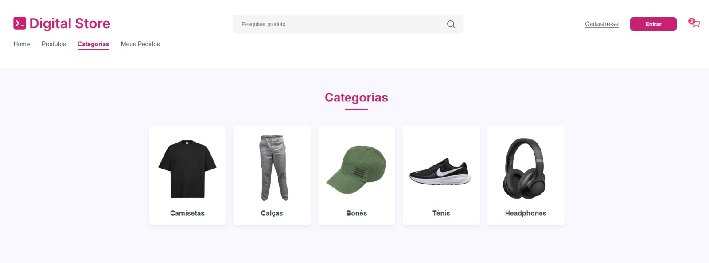

### 📦 Tela de Meus Pedidos
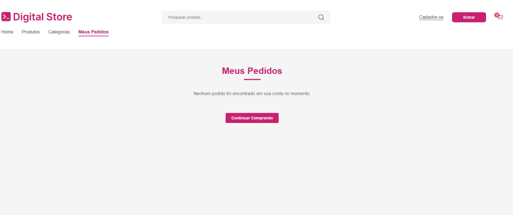

### 📱 Versão Mobile (Responsividade 100% Adaptável)

Abaixo, um mosaico das visões otimizadas para celulares, dispostas em ordem (Home, Vitrine, Telas de Compra, Menus e Filtros Off-Canvas):

<p align="center">
  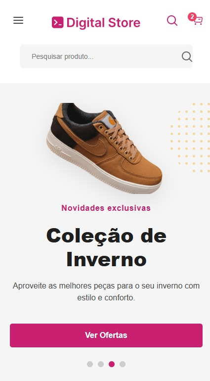
  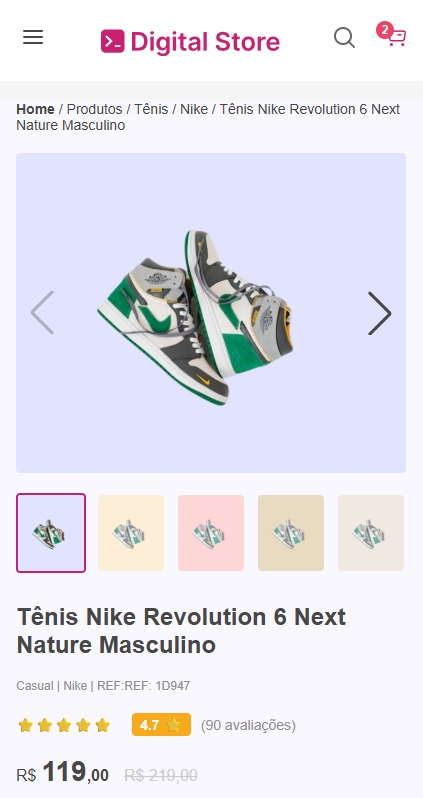
  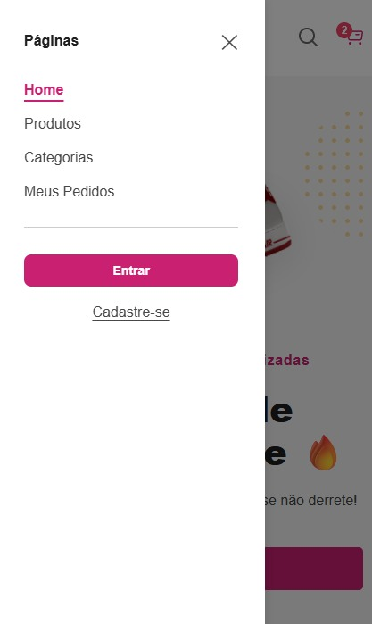
</p>
<p align="center">
  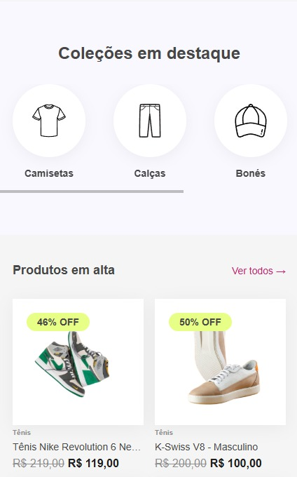
  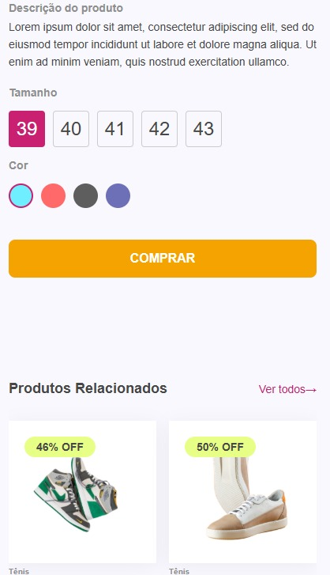
  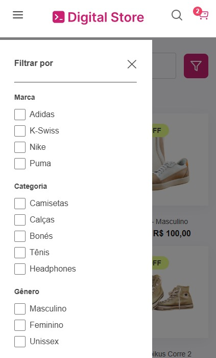
</p>